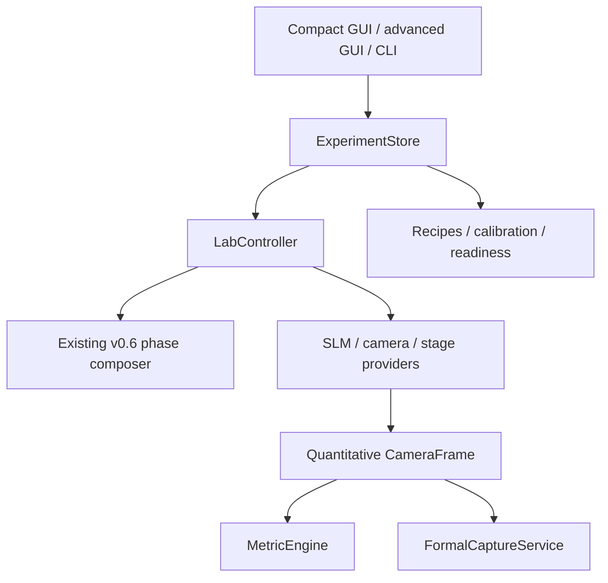

# Unified lab-control architecture

## Outcome

The implementation has one authoritative `ExperimentStore`. The compact SLM GUI,
advanced GUI, CLI, phase engine, device adapters, metric engine, capture service,
calibration graph and recipes all consume snapshots or structured change events
from that store. Qt widgets are clients; they are not the experiment state.

`LabController` is the single in-process owner of both SLM handles and of the
selected camera provider. This makes a future IPC hardware broker possible: the
client-facing operations can be transported without moving phase or experiment
logic back into widgets.

## Package boundaries

| Area | Responsibility | Must not do |
|---|---|---|
| `labcontrol.state` | Typed, serialisable state and structured deltas | Access hardware or Qt |
| `labcontrol.phase_service` | Adapt state to the proven complete-phase composer and hash results | Reimplement phase terms |
| `labcontrol.controller` | Own providers; coordinate generation, cast and acquisition | Calculate scientific metrics |
| `labcontrol.devices` | SLM, camera and stage contracts/adapters | Interpret beam physics |
| `labcontrol.metrics` | Quantitative single-frame analysis | Read rendered GUI pixels |
| `labcontrol.beam_walk` | Multi-plane fits and scientifically scoped labels | Claim absolute angle without rail calibration |
| `labcontrol.capture` | Immutable formal measurements and phase provenance | Treat live preview as evidence |
| `labcontrol.calibration` | Dependency invalidation and readiness | Invent calibration confidence |
| `labcontrol.recipes` | Resumable experiment sequencing | Depend on Qt callbacks |
| `labcontrol.sensorless` | Signed sweeps, drift controls, verification, rollback | Silently overwrite accepted state |
| `labcontrol.ui` | Operator interaction and display transforms | Own a second state or phase engine |

## One numerical frame pathway

`CameraProvider.acquire_frame()` returns a `CameraFrame` containing an untouched
float64 quantitative matrix. The same object is used for metrics, raw `.npy`
storage and display rendering. `render_preview()` creates separate uint8 display
pixels; percentile scaling, logarithmic scaling, gamma and colour never flow back
to analysis.

## Phase safety

The reusable service invokes `slm_lab_control.phase.compose_phase` directly.
Carrier, wavefront, vortex, axicon, focus, steering, low-order, retrieved and
custom terms are added before one final modulo operation. HEDS transfers remain
in the existing backend, including wavelength set/readback and explicit radians
with a 2π phase unit. No second composer or correction-stack path was introduced.

## Implementation status

| Capability | Status | Meaning |
|---|---|---|
| State, events, metrics, capture, recipes, calibration, sensorless, CLI | **SOFTWARE-TESTED** | Automated tests execute the implemented behavior |
| Quantitative replay and closed-loop demo | **REPLAY-VALIDATED** | Runs end to end through `ReplayCameraProvider` |
| Archived Beamage v1 BMG reader | **REPLAY-VALIDATED** | Prior branch audit records 52 real BMG files passing strict parsing |
| Existing HEDS phase-safe implementation | **PHYSICALLY VALIDATED, inherited** | Preserved from the known-good lab branch; this refactor still needs a bench regression |
| New `HedsSlmProvider` adapter | **HARDWARE-UNVERIFIED in this branch** | Thin adapter is tested with the dummy path; run the lab checklist |
| Live Beamage named-pipe bridge | **HARDWARE-UNVERIFIED / bridge pending** | Correct provider boundary exists; vendor bridge is not fabricated |

## Current limits

- The broker boundary is in-process; no network/IPC service is shipped yet.
- The Beamage provider requires a lab-PC bridge built against Gentec's current
  official named-pipe example.
- Live metrics run in the GUI thread at a throttled rate; acquisition itself is
  isolated in a `QThread`. A separate analysis worker is the next step if full
  2048×2048 processing proves too slow.
- Automated physical stage movement is not implemented. The same recipe uses a
  `ManualStageProvider` prompt now and can accept a motorised provider later.
