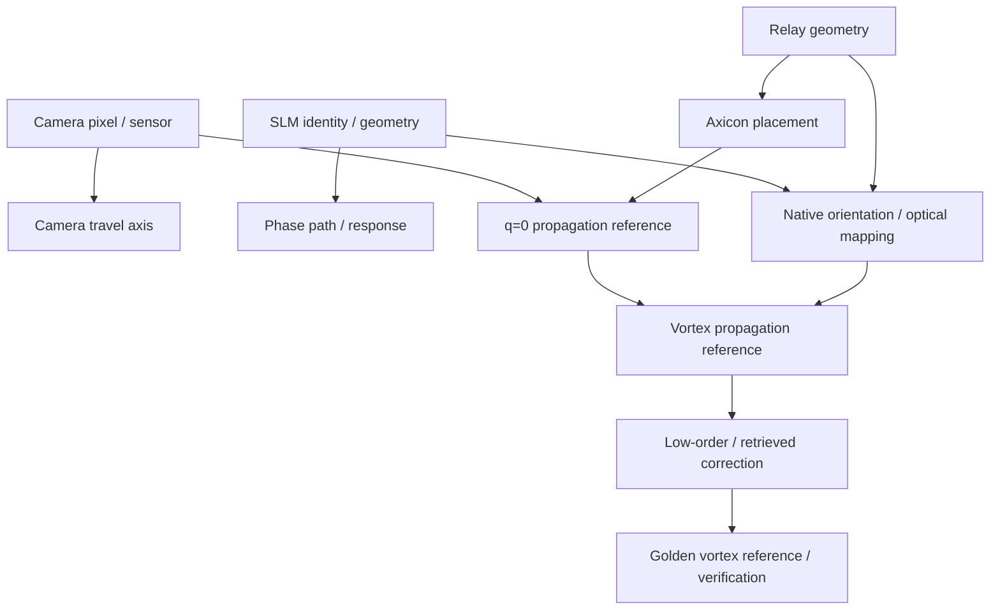

# Calibration dependency graph and readiness

`CalibrationRegistry` stores evidence-bearing `CalibrationRecord` objects. Each
record has a status, id, timestamp, dependencies, evidence paths, source session,
hardware fingerprint, optional quality metric, notes and stale reason.

Statuses are `UNKNOWN`, `VALID`, `STALE`, `PARTIALLY_VERIFIED` and `FAILED`.
Only `VALID` satisfies processing readiness. The software never turns an unknown
record into statistical confidence.

## Principal dependencies

The full implementation also keeps camera response, carrier convention, SLM
phase response and retrieved residual map as separate keys. See `DEPENDENCIES`
in `labcontrol/calibration.py` for the executable graph.

## Processing readiness

Default processing readiness requires valid:

- SLM phase path;
- camera pixel scale and sensor geometry;
- camera travel axis;
- axicon placement;
- q=0 and vortex propagation references;
- low-order correction;
- fresh vortex verification.

The report lists every status and derives an action from actual blockers. A
synthetic demo can become ready only within its explicitly labelled demo scope;
it never establishes readiness of the physical bench.

## Evidence rules

- `VALID` should cite immutable session/frame/report evidence.
- A quality number is recorded as a metric, not translated into confidence
  unless the calibration procedure defines and justifies that transformation.
- Loading a preset does not validate a calibration.
- A successful SDK call validates a command path, not the optical phase response.
- Accepting a sensorless command validates that command against its verification
  criteria, not the physical identity of the underlying aberration.
